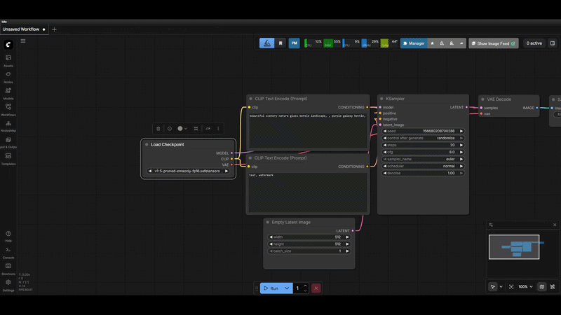
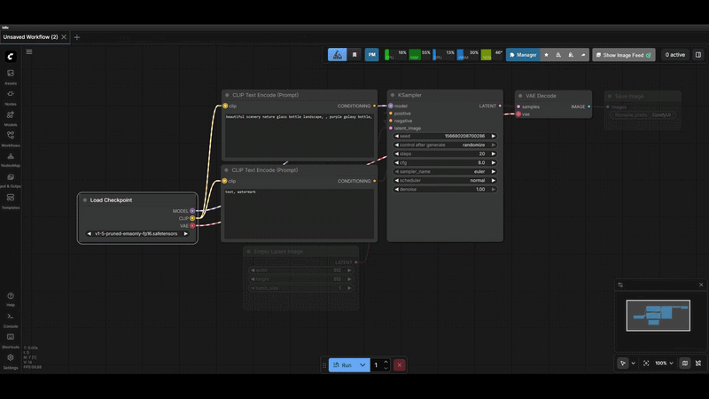
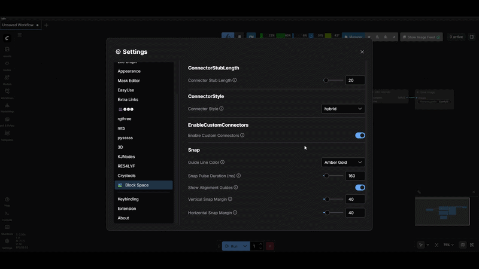
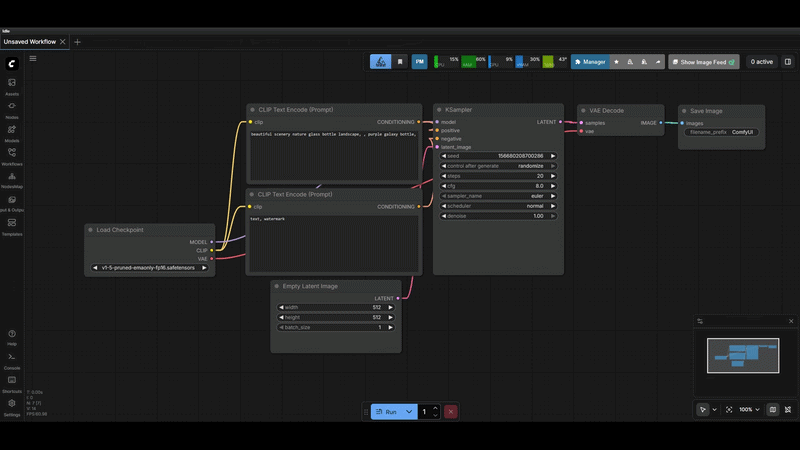
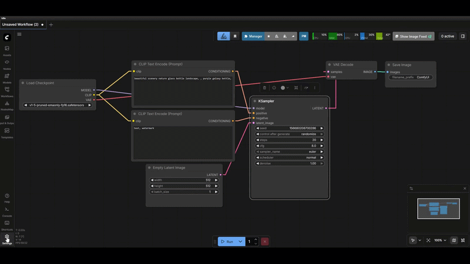

# ComfyUI-Block-Space 🧱

A Figma-style layout and snapping engine for the ComfyUI canvas. 

Tired of messy workflows and nodes overlapping? **Block-Space** replaces ComfyUI's default snapping with an intelligent, spatial-aware layout engine that brings professional UI design mechanics to your node graphs.

## ✨ Features

*   **Intelligent Raycast Snapping:** Nodes automatically align to the Top, Bottom, and Center of nearby nodes as you drag them.
*   **Topological Adjacency (Occlusion):** The engine is smart enough to ignore nodes that are blocked by other nodes, ensuring you only snap to immediate neighbors in your column or row.
*   **Isolated Node Support:** Dragging a node into empty space? It will scan the global rhythm of your canvas to keep your entire graph perfectly aligned horizontally and vertically.
*   **Visual Feedback:** Figma-style "SNAP" badges and alignment lines let you know exactly what your node is locking onto.
*   **Predictable Resizing:** Expanding a node snaps its dimensions to match the widths and heights of surrounding nodes for a uniform look.

## 🚀 Installation

**Method 1: ComfyUI Manager (Recommended)**
1. Open the ComfyUI Manager.
2. Search for `ComfyUI-Block-Space`.
3. Click **Install** and restart ComfyUI.

**Method 2: Manual Git Clone**
Navigate to your ComfyUI `custom_nodes` folder in your terminal and run:
```bash
git clone https://github.com/tywoodev/ComfyUI-Block-Space.git
```
Restart ComfyUI.

---

# Visual Deep Dive

The goal of Block Space is to transform ComfyUI into a pixel-perfect, high-efficiency design environment.

## 1. High-Fidelity Snapping & Harmonizing
Precision snapping that understands the visual geometry of your nodes. 



- **True Margins:** Snapping is 100% accurate to your settings, correctly accounting for node title bars so your gaps are always exactly the number of pixels you intended.
- **Harmonize Action:** Instantly transform messy node clusters into perfectly aligned blocks. Our intelligent layout engine detects columns, enforces uniform widths, and balances heights for a professional, "boxed" look.
- **Visual Guides:** Dotted alignment lines appear during drags and resizes to frame your nodes and show exactly which edges are being aligned.

## 2. Animated Flow Visualization
Gain instant clarity on your data flow with high-visibility animations and port indicators.



- **Port Color Matching:** The pulse animations and connection rings automatically match the color of the port (e.g., purple for CONDITIONING, yellow for CLIP), making it easy to follow paths in dense workflows.
- **Enhanced Stubs:** High-contrast rings (stubs) appear on active ports during focus, providing clear visual targets for easier tracing and connection management.
- **White-Dashed Overlays:** Animated overlays ensure you can see your active connections clearly against any background or node color.

## 3. Custom Connector Types
Choose the aesthetic that best fits your workflow and reduces visual noise.



- **Hybrid Style:** The best of both worlds. Features elegant curves for short hops and straight lines for longer runs, maintaining a clean yet organic look.
- **Straight Style:** Minimalist and direct. Perfect for high-density workflows where reducing overlapping curves is a priority.
- **Angled Style:** A technical, "circuit-board" aesthetic that creates very clear horizontal and vertical pathways, ideal for highly structured layouts.

## 4. Shift to Bypass Snapping
Handle intricate positioning with ease without fighting the alignment engine.



- **Micro-Adjustments:** Hold the **Shift** key while dragging or resizing to temporarily disable snapping. This allows for pixel-perfect placement in tight spaces where you need a node to sit between standard grid points.
- **Total Control:** Bypass gives you the freedom to handle unique edge cases without needing to toggle snapping off in the settings menu.

## 5. Professional Settings Panel
Customize your experience with an intuitive, branded interface.



- **Informative Tooltips:** Hover over any setting name for a detailed explanation of its behavior.
- **Real-Time Updates:** Most settings apply immediately, allowing you to fine-tune your margins and colors without refreshing your browser. (A refresh is required after changing the ConnectorStyle)

---

## License

MIT License - see [LICENSE](LICENSE) for details.
